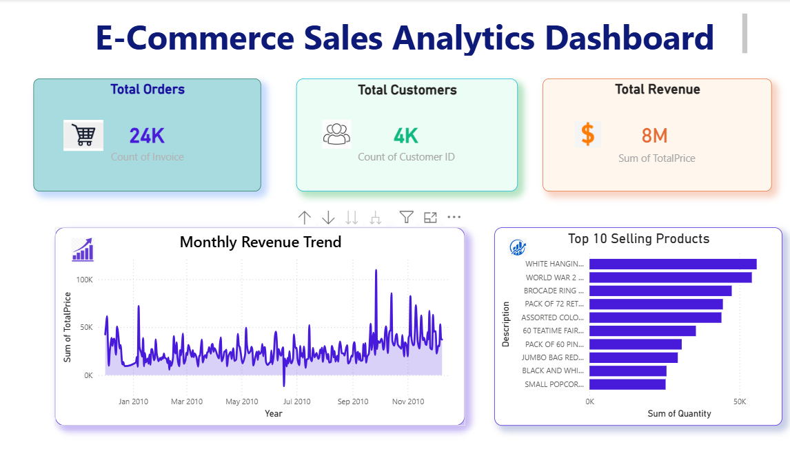
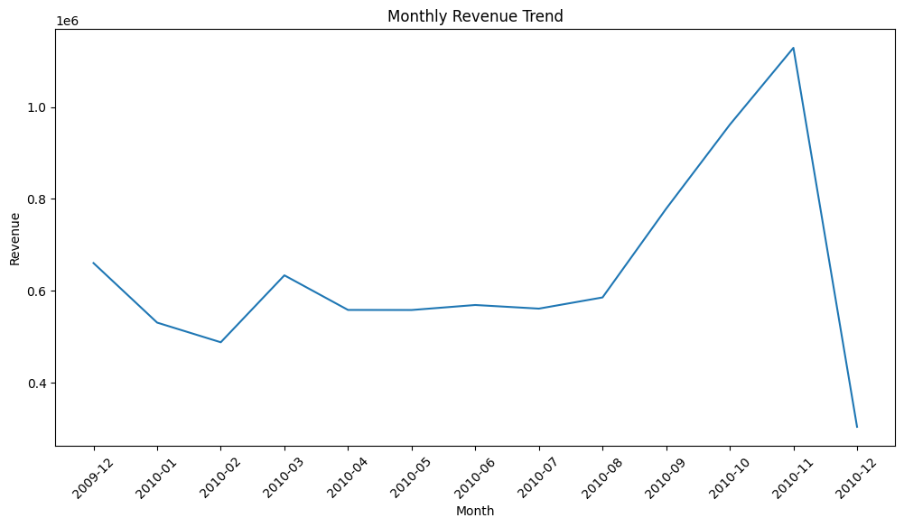
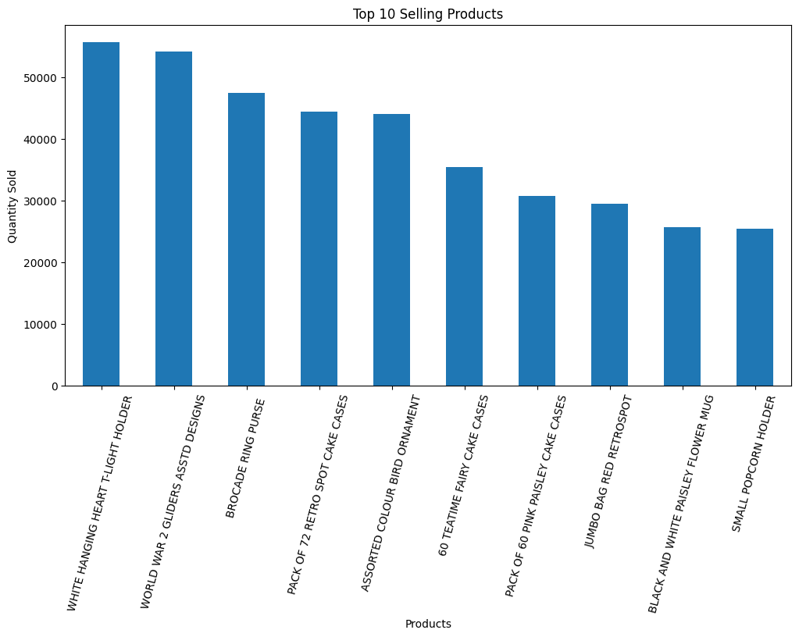
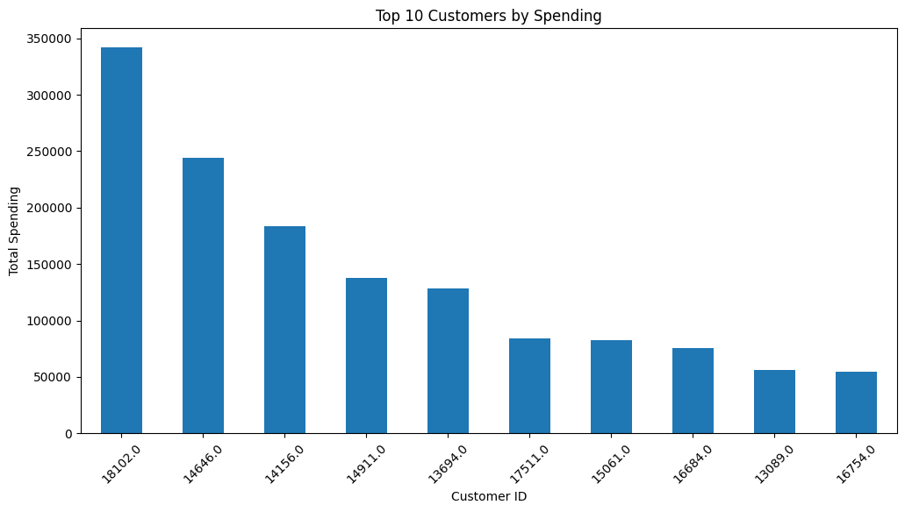
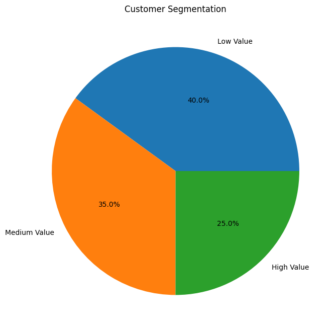

# 📊 E-Commerce Sales Analytics Dashboard


An interactive Power BI dashboard that transforms raw e-commerce transaction data into actionable business insights — covering revenue trends, customer behavior, order performance, and top-selling products.

## Dashboard Preview



## 📌 Project Overview

This project analyzes e-commerce sales data using **Microsoft Power BI** to transform raw data into meaningful business insights. An interactive dashboard was developed to monitor sales performance, revenue trends, customer activity, and product performance.

The project demonstrates **data cleaning, data transformation, DAX-based KPI calculation, data visualization, and exploratory analysis in Python** to support data-driven decision-making.

## 🗂️ Data Source

- **Dataset:** Online Retail II
- **Source:** UCI Machine Learning Repository
- **Link:** https://archive.ics.uci.edu/dataset/502/online+retail+ii
- **Date Range:** December 2009 – December 2011
- **Description:** Transaction-level data from a UK-based, non-store online retailer specializing in unique all-occasion gift-ware. Many of the retailer's customers are wholesalers.
- **Fields:** Invoice number, stock code, product description, quantity, invoice date, unit price, customer ID, and country

## 🧹 Methodology

1. **Data Cleaning & Transformation** — Power Query was used to clean and reshape raw transaction data (handling nulls, standardizing date/customer fields, removing duplicates).
2. **KPI Modeling** — DAX measures were built to calculate revenue, order counts, customer counts, and time-based trends.
3. **Exploratory Analysis** — A Python/Jupyter notebook (`notebooks/analysis.ipynb`) was used to explore the dataset ahead of dashboard design.
4. **Dashboard Design** — Visuals were built in Power BI to surface trends, top performers, and customer segments interactively.

## 🚀 Features

- 💰 Total Revenue Analysis
- 🛒 Total Orders Tracking
- 👥 Customer Analysis
- 📈 Monthly Revenue Trend Analysis
- 📦 Top-Selling Product Analysis

## 🛠️ Tools & Technologies

- Power BI
- Power Query
- DAX
- Python
- Jupyter Notebook

## 📋 Prerequisites

To explore and run this project, you will need:

- Microsoft Power BI Desktop
- Python 3.x
- Jupyter Notebook
- Required Python libraries used in the analysis notebook (pandas, matplotlib, etc.)

## 📁 Project Structure

```text
 ecommerce-sales-analytics-dashboard/
│
├── dashboard/
│     └── Ecommerce-Analytics-Project.pbix         # Interactive Power BI dashboard       
│
├── notebooks/
│   └── analysis.ipynb        # Python-based exploratory analysis
│
├── images/
│   ├── dashboard-preview.png             # Main dashboard preview
│   ├── monthly-revenue-trend.png         # Monthly revenue trend visual
│   ├── top-products.png                  # Top-selling products visual
│   ├── top-customers.png                 # Top customers by spending visual
│   └── customer-segmentation.png         # Customer segmentation visual
│
└── README.md
```
## 📊 Key Business Insights

- 💰 **Total Revenue:** 8M
- 🛒 **Total Orders:** 24K
- 👥 **Total Customers:** 4K
- 📦 **Top-Selling Product:** White Hanging Heart T-Light Holder
- 📈 **Revenue Trend:** Higher sales activity was observed toward the end of the year, with several significant revenue spikes.

## 📈 Dashboard Insights

The dashboard provides an interactive view of e-commerce business performance, helping users understand:

- Revenue trends
- Customer activity
- Order volume
- Product performance
- Overall business performance

## ▶️ How to Use the Project

1. Download `dashboard/Ecommerce-Analytics-Project.pbix` from this repository.
2. Open the file using **Microsoft Power BI Desktop**.
3. Explore the interactive dashboard using the available visuals, filters, and charts.
4. Open `notebooks/analysis.ipynb` in Jupyter Notebook to explore the Python-based analysis.

## 🔮 Future Enhancements

- Add interactive customer segmentation analysis.
- Include geographical sales analysis.
- Add profit and profit-margin KPIs.
- Develop additional time-based sales comparisons.
- Add advanced customer behavior analysis.
- Publish the dashboard to Power BI Service for online access.

## 📸 Project Visualizations

### 📈 Monthly Revenue Trend


### 📦 Top 10 Selling Products


### 👥 Top 10 Customers by Spending


### 🧩 Customer Segmentation


## 🧠 Skills Demonstrated

- Data cleaning & transformation (Power Query)
- DAX measure design & KPI modeling
- Interactive dashboard design (Power BI)
- Exploratory data analysis (Python, pandas)
- Business insight communication

## 📄 License

This project is licensed under the MIT License — see the [LICENSE](LICENSE) file for details.
